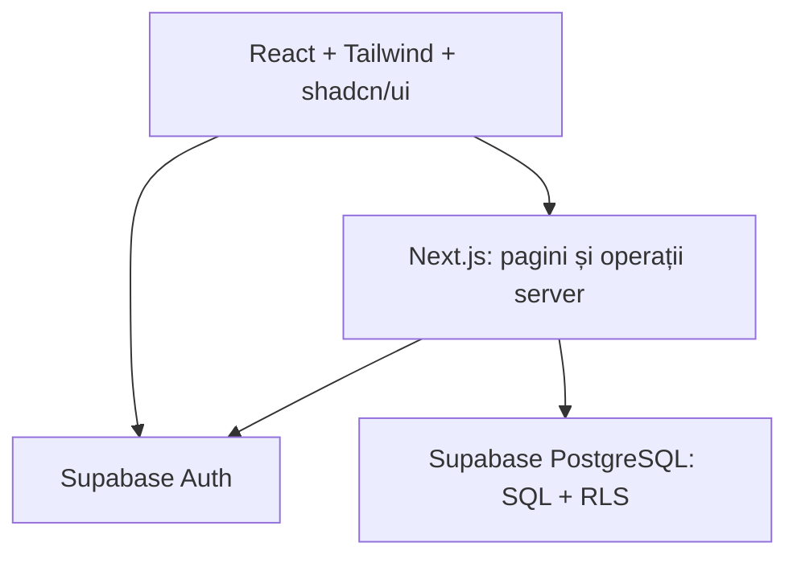

# AUTOSTART VANCEA Manager — dosar tehnic central

**Versiune:** 1.1 — schema PostgreSQL definită pentru revizuire  
**Data:** 23.09.2026  
**Domeniu:** administrarea unei școli de șoferi, exclusiv categoria B  
**Stadiu:** etapa 1 (Git și Next.js) finalizată conform verificărilor beneficiarului; etapa 2 este pregătită la nivel de proiectare. Acest dosar nu este o migrație SQL executabilă.

## 1. Scop, limite și vocabular

Aplicația urmărește întregul parcurs administrativ al unui cursant: înregistrarea persoanei, înscrierea, repartizarea instructorului, ședințele practice, plățile și încercările de examen. Personalul școlii vede datele necesare activității sale, iar cursantul vede numai datele proprii. Proiectul academic trebuie să arate distinct interfața React, logica de server Next.js, modelarea relațională și interogările SQL, autentificarea, autorizarea, validările, algoritmul pentru suprapuneri și testarea.

Versiunea 1 este pentru o singură școală și categoria B. Nu include alte categorii, plăți online, emiterea documentelor oficiale, SMS, integrare cu autorități sau reguli legale privind eligibilitatea la examen care nu au fost specificate. Datele demonstrative vor fi fictive.

**Termeni:** „înscriere activă” = rând în `inscrieri` cu `stare = 'activa'`; „programare ocupantă” = programare `programata`, `finalizata` sau `absent`; „ședință practică” = interval fix de 90 de minute; „tarif agreat” = prețul fixat pentru înscrierea concretă, în RON; „rest de plată” = diferența dintre tarif și plățile nete confirmate.

## 2. Cerințe funcționale

| ID | Cerință și rezultat observabil |
| --- | --- |
| F01 | Autentificare prin Supabase Auth și deconectare; utilizatorii fără cont activ nu văd datele școlii. |
| F02 | Rolurile `administrator`, `secretariat`, `instructor`, `cursant` determină atât paginile, cât și operațiile acceptate de server și baza de date. |
| F03 | Administrare persoane și cursanți: creare, citire, corectare, căutare și trecere în stare inactivă, cu validarea datelor. |
| F04 | Administrare instructori și vehicule, inclusiv starea de disponibilitate. |
| F05 | Înscriere cursant la B, stabilire tarif și repartizare instructor; păstrarea înscrierilor mai vechi. |
| F06 | Creare, vizualizare, filtrare și anulare programări; utilizatorul alege începutul, iar sfârșitul este calculat la +90 minute; suprapunerile de cursant, instructor sau vehicul sunt respinse inclusiv la cereri simultane. |
| F07 | Trecere ședință în `finalizata` sau `absent`; fiecare ședință finalizată adaugă 90 de minute la totalul calculat. |
| F08 | Înregistrare plăți și rambursări cu trasabilitate; total achitat și rest calculate la citire, per înscriere. |
| F09 | Înregistrare încercări distincte de examen `teoretic` și `practic`, cu istoric și rezultat. |
| F10 | Panou principal cu indicatori relevanți rolului; rapoarte filtrabile, fără scurgere de informații între utilizatori. |
| F11 | Căutare și filtrare pentru listele autorizate; feedback clar pentru date invalide, lipsă rezultate și conflicte de programare. |
| F12 | CRUD logic: operațiile de „ștergere” pentru înregistrări importante modifică starea sau înregistrează o corecție, fără eliminarea fizică obișnuită. |

## 3. Cerințe nefuncționale

| ID | Cerință verificabilă |
| --- | --- |
| N01 | Interfață în română, utilizabilă la 360 px (telefon), 768 px (tabletă) și 1280 px (calculator), fără derulare orizontală pentru fluxurile principale. |
| N02 | Navigare cu tastatura, etichete pentru câmpuri, stare de focus vizibilă, mesaje de eroare asociate câmpurilor și contrast lizibil. |
| N03 | Validare atât în interfață, cât și pe server; constrângeri SQL pentru integritatea care trebuie să reziste inclusiv accesului concurent. |
| N04 | Datele personale se afișează doar în limita atribuțiilor; nu se publică secrete, parole, CNP sau date reale în cod, teste și capturi. |
| N05 | Istoricul înscrierilor, programărilor, plăților și examenelor rămâne inteligibil după schimbarea stărilor. |
| N06 | Un set de date demonstrative de ordinul a 1.000 de cursanți permite căutare paginată și pagini principale utilizabile; timpul de răspuns se măsoară în test, fără promisiune de SLA pentru servicii externe. |
| N07 | Migrații SQL versionate, cod tipizat, convenții românești consecvente și instrucțiuni de rulare reproductibile pe Windows. |
| N08 | Erorile din jurnale nu includ parole, tokenuri sau date personale inutile; accesul la mediu și copiile de siguranță se stabilesc înaintea datelor reale. |

## 4. Roluri și permisiuni

`utilizatori.rol` reprezintă **un singur rol principal** pentru un cont în versiunea 1. O persoană poate exista în `persoane` fără cont de autentificare; `utilizatori` este legătura opțională cu `auth.users`. Contul administratorului inițial se creează printr-o procedură administrativă protejată, nu prin înscriere publică. Conturile personalului și cursanților sunt invitate sau activate de administrator.

| Resursă / acțiune | administrator | secretariat | instructor | cursant |
| --- | --- | --- | --- | --- |
| Conturi și atribuirea rolurilor | Creează, dezactivează, schimbă rol | Fără acces | Fără acces | Fără acces |
| Persoane, cursanți și instructori | Administrare | Administrare | Citește doar datele necesare cursanților repartizați | Citește propriul profil |
| Vehicule | Administrare | Administrare | Citește vehiculele relevante programărilor sale | Citește doar vehiculul propriei programări |
| Înscrieri | Administrare | Creează, modifică stare și repartizează | Citește înscrierile repartizate | Citește propriile înscrieri |
| Programări | Administrare | Creează, replanifică prin anulare și creare, anulează | Citește propriile ședințe; marchează doar ședințele sale `finalizata`/`absent` | Citește propriile ședințe |
| CNP din `cursanti` | Acces complet, cu motiv operațional | Acces pentru înregistrare/corectare, cu motiv operațional | Fără acces | Fără acces direct la coloana CNP în V1 |
| Plăți/rambursări | Administrare și rambursări | Înregistrează plăți și citește | Fără acces la sume | Citește propriul istoric și restul |
| Examene | Administrare | Înregistrează încercări și rezultate | Citește rezultatele cursanților repartizați | Citește propriul istoric |
| Panou și rapoarte | Total școală | Operațional și financiar | Numai activitatea proprie | Numai datele proprii |

Interfața ascunde acțiunile interzise, însă fiecare citire sau scriere este verificată din nou în server și, pentru tabelele expuse, în RLS. Un instructor care pierde repartizarea păstrează acces numai la ședințele sale istorice și la informația minimă necesară pentru ele; nu primește implicit acces la toate datele cursantului. Este interzisă modificarea propriului rol prin actualizarea directă a `utilizatori`.

## 5. Module și arhitectură

Module: **acces și conturi**, **persoane/cursanți**, **instructori**, **vehicule**, **înscrieri**, **programări/ședințe**, **plăți**, **examene**, **panou/rapoarte**, **administrare și documentație**. Fiecare modul are pagini, validări, operații pe server, interogări și teste aferente.



- **Frontend:** Next.js App Router + React + TypeScript, Tailwind CSS și componente shadcn/ui. Afișează formulare, liste, filtre și feedback; poate valida imediat cu Zod, dar nu decide singur drepturile.
- **Backend:** componente server, acțiuni server sau rute Next.js. Citește identitatea verificată, încarcă rolul din datele controlate de aplicație, validează cu Zod, autorizează operația și transmite cererea către baza de date. Serverul nu acceptă `rol`, `id_cursant` sau `id_utilizator_creare` de la client ca dovadă de autoritate.
- **Date:** PostgreSQL în Supabase; chei străine, indexuri, constrângeri, interogări agregate, RLS și operații tranzacționale. Pentru verificările care privesc mai multe tabele se proiectează funcții/declanșatoare SQL cu drepturi restrânse și teste de concurență; un simplu mesaj în formular nu garantează integritatea.
- **Sesiune:** integrare Supabase SSR cu cookie și client separat pentru server/browser, potrivit documentației versiunii instalate. Cheia publicabilă poate fi folosită cu RLS; o cheie secretă rămâne exclusiv pe server și se evită în fluxurile obișnuite. [S1] [S2]
- **Publicare ulterioară:** Git/GitHub pentru surse și migrații, Vercel pentru aplicație, Supabase pentru Auth și date. Publicarea este etapa 18, după teste și configurarea mediului; nu face parte din acest dosar.

### Traseul unei operații sensibile

Exemplu: secretariatul trimite o programare → Zod verifică data și începutul → serverul verifică identitatea și rolul → PostgreSQL calculează sfârșitul și verifică înscrierea/resursele → două constrângeri de excludere protejează instructorul și vehiculul, iar o verificare tranzacțională protejează cursantul → RLS/granturile limitează accesul → interfața afișează confirmare sau conflict. Niciun pas din browser nu înlocuiește controlul de la server sau din baza de date.

## 6. Schema relațională propusă

Schema cuprinde **exact cele nouă tabele proprii aprobate**; `auth.users` aparține Supabase Auth. Toate cheile primare, cu excepția `utilizatori.id_utilizator`, sunt `uuid NOT NULL DEFAULT gen_random_uuid()`. Fiecare tabelă are `data_crearii timestamptz NOT NULL DEFAULT now()` și `data_modificarii timestamptz NOT NULL DEFAULT now()`, actualizată la modificare. Timpurile se stochează ca `timestamptz` și se afișează în `Europe/Bucharest`. Aceste două date de audit nu constituie un jurnal complet al tuturor modificărilor.

Tabelul următor este **contractul de proiectare pentru migrație**, nu SQL executat. `NN` înseamnă `NOT NULL`; câmpurile marcate `NULL` sunt opționale. Coloanele de audit comune se subînțeleg în fiecare rând.

| Tabelă | Chei și date de bază propuse | Legături / constrângeri esențiale |
| --- | --- | --- |
| `persoane` | `id_persoana` PK; `nume varchar(100) NN`, `prenume varchar(100) NN`, `telefon varchar(30) NULL`, `email varchar(254) NULL`, `data_nasterii date NULL`, `adresa text NULL` | `CHECK (btrim(nume) <> '' AND btrim(prenume) <> '')`. Numele și emailul de contact nu sunt chei unice; emailul de login rămâne în Auth. |
| `utilizatori` | `id_utilizator uuid PK NN`, `id_persoana uuid NN UNIQUE`, `rol varchar(20) NN`, `activ boolean NN DEFAULT true` | `id_utilizator` FK la `auth.users(id)`; `id_persoana` FK la `persoane`. `CHECK (rol IN ('administrator','secretariat','instructor','cursant'))`; rolul nu poate fi modificat direct de titular. Fără coloană de parolă. |
| `cursanti` | `id_cursant` PK, `id_persoana uuid NN UNIQUE`, `cnp varchar(13) NN UNIQUE`, `stare varchar(10) NN DEFAULT 'activ'`, `observatii text NULL` | FK la `persoane`. `CHECK (cnp ~ '^[0-9]{13}$')` validează formatul, nu identitatea reală; `CHECK (stare IN ('activ','inactiv'))`. Date demo exclusiv fictive; CNP este separat de datele vizibile instructorului. |
| `instructori` | `id_instructor` PK, `id_persoana uuid NN UNIQUE`, `data_angajarii date NULL`, `stare varchar(10) NN DEFAULT 'activ'`, `observatii text NULL` | FK la `persoane`; `CHECK (stare IN ('activ','inactiv'))`. Numai un instructor activ poate primi înscrieri și ședințe noi. |
| `vehicule` | `id_vehicul` PK, `numar_inmatriculare varchar(20) NN UNIQUE`, `marca varchar(100) NN`, `model varchar(100) NN`, `an_fabricatie smallint NULL`, `stare varchar(15) NN DEFAULT 'activ'`, `observatii text NULL` | Numărul este păstrat canonic, cu majuscule și fără spații; `CHECK` verifică această formă și câmpurile nevidate; `CHECK (an_fabricatie >= 1900)` când este prezent; `stare IN ('activ','service','indisponibil','inactiv')`. |
| `inscrieri` | `id_inscriere` PK, `id_cursant uuid NN`, `id_instructor uuid NN`, `categorie char(1) NN DEFAULT 'B'`, `data_inscrierii date NN DEFAULT CURRENT_DATE`, `tarif_curs numeric(12,2) NN`, `stare varchar(12) NN DEFAULT 'activa'`, `data_finalizarii date NULL`, `observatii text NULL` | FK la cursant și instructor; `CHECK (categorie = 'B')`, `CHECK (tarif_curs > 0)`, stare din `activa/finalizata/anulata`; `data_finalizarii` este obligatorie exact la `finalizata` și nu poate preceda înscrierea. Index unic parțial pentru o singură înscriere activă/cursant. |
| `programari` | `id_programare` PK, `id_inscriere uuid NN`, `id_instructor uuid NN`, `id_vehicul uuid NN`, `inceput timestamptz NN`, `sfarsit timestamptz NN`, `stare varchar(12) NN DEFAULT 'programata'`, `id_utilizator_creare uuid NN`, `observatii text NULL` | FK la înscriere, instructor, vehicul și utilizatorul creator; **nu există `id_cursant`**. `CHECK (sfarsit - inceput = interval '90 minutes')`; stare din `programata/finalizata/anulata/absent`. Un trigger calculează `sfarsit` din `inceput`; capătul de interval este deschis. |
| `plati` | `id_plata` PK, `id_inscriere uuid NN`, `id_utilizator_inregistrare uuid NN`, `id_plata_initiala uuid NULL`, `tip varchar(12) NN`, `suma numeric(12,2) NN`, `stare varchar(15) NN`, `data_platii timestamptz NN DEFAULT now()`, `metoda_plata varchar(20) NULL`, `referinta text NULL` | FK la înscriere/utilizator și FK propriu la plata inițială; `tip IN ('plata','rambursare')`, `stare IN ('in_asteptare','confirmata','anulata')`, `suma > 0`; rambursarea cere `id_plata_initiala`, plata obișnuită îl interzice. Soldul și limita rambursărilor se validează tranzacțional. |
| `examene` | `id_examen` PK, `id_inscriere uuid NN`, `tip_examen varchar(10) NN`, `numar_incercare smallint NN`, `data_examenului timestamptz NN`, `stare varchar(15) NN`, `rezultat varchar(10) NULL`, `punctaj smallint NULL`, `observatii text NULL` | FK la înscriere; `UNIQUE(id_inscriere,tip_examen,numar_incercare)`, încercare > 0, tip `teoretic/practic`; stare `programat/sustinut/anulat/neprezentat`. `rezultat` este `admis/respins` numai și obligatoriu când examenul este `sustinut`; punctaj nenegativ numai la teorie. |

Relații principale: `persoane` 1–0..1 `utilizatori` / `cursanti` / `instructori`; `cursanti` 1–N `inscrieri`; `instructori` 1–N `inscrieri`; `inscrieri` 1–N `programari`, `plati`, `examene`; `instructori` și `vehicule` 1–N `programari`. Cursantul unei ședințe se obține exclusiv prin `programari.id_inscriere → inscrieri.id_cursant`; instructorul efectiv al ședinței rămâne în `programari.id_instructor` după schimbarea repartizării curente.

### 6.1. Chei străine, unicitate și ștergere

- **PK:** `id_persoana`, `id_utilizator`, `id_cursant`, `id_instructor`, `id_vehicul`, `id_inscriere`, `id_programare`, `id_plata`, respectiv `id_examen` în cele nouă tabele. PK implică unicitate și `NOT NULL`.
- **FK complete:** `utilizatori.id_utilizator → auth.users.id`; `utilizatori.id_persoana`, `cursanti.id_persoana`, `instructori.id_persoana → persoane.id_persoana`; `inscrieri.id_cursant → cursanti.id_cursant`, `inscrieri.id_instructor → instructori.id_instructor`; `programari.id_inscriere → inscrieri.id_inscriere`, `programari.id_instructor → instructori.id_instructor`, `programari.id_vehicul → vehicule.id_vehicul`, `programari.id_utilizator_creare → utilizatori.id_utilizator`; `plati.id_inscriere → inscrieri.id_inscriere`, `plati.id_utilizator_inregistrare → utilizatori.id_utilizator`, `plati.id_plata_initiala → plati.id_plata`; `examene.id_inscriere → inscrieri.id_inscriere`. Toate FK folosesc `ON DELETE RESTRICT` și `ON UPDATE RESTRICT`, fără cascadă către date istorice.
- **UNIQUE:** `utilizatori.id_persoana`, `cursanti.id_persoana`, `cursanti.cnp`, `instructori.id_persoana`, `vehicule.numar_inmatriculare`, tripletul `(examene.id_inscriere, tip_examen, numar_incercare)`; `inscrieri.id_cursant` este unic **numai** când `stare = 'activa'` prin index parțial. Se păstrează oricâte înscrieri mai vechi încheiate. [P1]
- **CHECK:** expresiile de mai jos sunt contractul exact pentru valorile unui singur rând. Valorile opționale pot fi `NULL` numai acolo unde tabelul le declară astfel. Regulile care citesc **alte rânduri sau tabele** se aplică prin operații/trigger SQL, nu prin `CHECK`. [P1]
- **Ștergere:** în fluxurile obișnuite, persoanele, utilizatorii, cursanții, instructorii și vehiculele sunt dezactivate; înscrierile, programările, plățile și examenele sunt păstrate cu stările lor. Nu se oferă `DELETE` pentru rolurile aplicației. FK cu `RESTRICT` împiedică și ștergerea unui cont din `auth.users` cât timp profilul referă contul; un caz excepțional de eliminare/anonymizare se tratează printr-o procedură administrativă distinctă.

| Tabelă | Expresii `CHECK` pentru migrație |
| --- | --- |
| `persoane` | `btrim(nume) <> '' AND btrim(prenume) <> ''` |
| `utilizatori` | `rol IN ('administrator','secretariat','instructor','cursant')` |
| `cursanti` | `cnp ~ '^[0-9]{13}$'`; `stare IN ('activ','inactiv')` |
| `instructori` | `stare IN ('activ','inactiv')` |
| `vehicule` | `numar_inmatriculare ~ '^[A-Z0-9]+$'`; `btrim(marca) <> '' AND btrim(model) <> ''`; `an_fabricatie >= 1900` dacă nu este `NULL`; `stare IN ('activ','service','indisponibil','inactiv')` |
| `inscrieri` | `categorie = 'B'`; `tarif_curs > 0`; `stare IN ('activa','finalizata','anulata')`; `(stare = 'finalizata') = (data_finalizarii IS NOT NULL)`; `data_finalizarii IS NULL OR data_finalizarii >= data_inscrierii` |
| `programari` | `stare IN ('programata','finalizata','anulata','absent')`; `sfarsit - inceput = interval '90 minutes'` |
| `plati` | `tip IN ('plata','rambursare')`; `stare IN ('in_asteptare','confirmata','anulata')`; `suma > 0`; `(tip = 'rambursare') = (id_plata_initiala IS NOT NULL)`; `id_plata_initiala IS NULL OR id_plata_initiala <> id_plata` |
| `examene` | `tip_examen IN ('teoretic','practic')`; `numar_incercare > 0`; `stare IN ('programat','sustinut','anulat','neprezentat')`; `rezultat IS NULL OR rezultat IN ('admis','respins')`; `(stare = 'sustinut') = (rezultat IS NOT NULL)`; `punctaj IS NULL OR (tip_examen = 'teoretic' AND punctaj >= 0)` |

Pentru numărul de înmatriculare, intrarea este normalizată la majuscule fără spații sau separator înainte de salvare; `CHECK` previne forme diferite care ar ocoli `UNIQUE`. Verificarea de 13 cifre a CNP nu pretinde că un număr fictiv corespunde unei persoane reale și nu verifică cifra de control. Formatele email/telefon sunt validate la nivelul formularului și al serverului, fără o expresie SQL care să respingă adrese legitime.

### 6.2. Indexuri proiectate

| Nume planificat | Tabel / expresie | Motiv |
| --- | --- | --- |
| `uq_inscrieri_cursant_activ` | UNIQUE `inscrieri(id_cursant) WHERE stare = 'activa'` | O singură înscriere activă, inclusiv la concurență. |
| `ex_programari_instructor` | GiST: `id_instructor WITH =`, `tstzrange(inceput,sfarsit,'[)') WITH &&`, doar `stare IN ('programata','finalizata','absent')` | Fără suprapuneri ale instructorului. |
| `ex_programari_vehicul` | GiST: `id_vehicul WITH =`, același interval și predicat | Fără suprapuneri ale vehiculului. |
| `idx_persoane_nume_prenume` | `persoane(nume,prenume)` | Listă și sortare. |
| `idx_inscrieri_cursant` / `idx_inscrieri_instructor` | `inscrieri(id_cursant)` / `(id_instructor)` | Istoric, autorizare și verificarea tuturor înscrierilor, nu numai a celei active. |
| `idx_programari_inscriere_inceput` | `programari(id_inscriere,inceput)` | Căutarea rezervărilor unui cursant prin înscrierile sale. |
| `idx_programari_instructor_inceput` / `idx_programari_vehicul_inceput` | `programari(id_instructor,inceput)` / `(id_vehicul,inceput)` | Calendare și filtrare cronologică. |
| `idx_plati_inscriere_data` / `idx_plati_initiala` | `plati(id_inscriere,data_platii)` / `(id_plata_initiala)` | Sold și verificarea rambursărilor. |
| `idx_examene_inscriere_data` | `examene(id_inscriere,data_examenului)` | Istoricul încercărilor. |

PK și `UNIQUE` complete își creează deja indexuri; nu le duplicăm. Extensia `btree_gist` este necesară pentru combinarea egalității UUID cu intervalul în GiST. [P2]

### 6.3. Durata fixă și integritatea calendarului

1. Interfața primește **data și ora de început**, le interpretează în `Europe/Bucharest` și afișează informativ sfârșitul la +90 de minute. La orele locale inexistente sau repetate la schimbarea orei se cere corectarea intrării; instanța stocată este un `timestamptz` neambiguu. Serverul acceptă doar începutul, înscrierea și resursele, fără a avea încredere în un `sfarsit` trimis de client.
2. Un trigger `BEFORE INSERT OR UPDATE` din PostgreSQL stabilește `sfarsit = inceput + interval '90 minutes'` la inserare, iar la actualizare refuză schimbarea lui `inceput`, `sfarsit` sau a FK-urilor. `sfarsit` se stochează pentru indexarea intervalului, iar `CHECK` îi impune exact durata. Reprogramarea anulează rândul vechi și creează altul. Tranziții permise: `programata → finalizata / absent / anulata`; stările finale nu se reactivează.
3. Pentru instructor și vehicul, cele două constrângeri de excludere GiST împiedică suprapunerile chiar la două inserări simultane. Folosim intervale **`[început, sfârșit)`**: 10:00–11:30 și 11:30–13:00 sunt consecutive și permise, 11:00–12:30 este conflict. Rândurile `anulata` nu blochează intervalul; cele finalizate și cu `absent` rămân în istoric și în verificare. [P2]
4. **Cursantul nu se află în `programari`.** Un trigger tranzacțional găsește cursantul din `id_inscriere`, blochează rândul său din `cursanti` cu `SELECT ... FOR UPDATE`, apoi caută, prin `programari JOIN inscrieri`, orice rezervare ocupantă a sa pentru care `p.inceput < nou.sfarsit AND nou.inceput < p.sfarsit`. Interogarea de conflict se face după dobândirea blocării, la nivelul implicit `READ COMMITTED`, și exclude propriul rând la o eventuală actualizare. Toate căile de inserare/actualizare relevante trec prin trigger; `inscrieri.id_cursant` devine nemodificabil după creare. Astfel două cereri pentru același cursant sunt serializate chiar dacă provin din înscrieri istorice diferite. Această garanție cere test cu două conexiuni simultane. [P3]
5. Aceeași operație validează înscrierea `activa`, cursantul/instructorul activi, `programari.id_instructor = inscrieri.id_instructor` la rezervare și vehiculul `activ`; blochează resursele într-o ordine constantă. Trecerea unui vehicul în `service/indisponibil`, dezactivarea instructorului, schimbarea repartizării sau închiderea înscrierii sunt refuzate cât timp există programări viitoare `programata` afectate. Funcțiile de trigger care trebuie să vadă toate rezervările se securizează cu drepturi limitate și `search_path` fix, ca RLS să nu ascundă o coliziune.
6. Numărul de ședințe efectuate este `COUNT(programari WHERE stare = 'finalizata')` pentru toate înscrierile relevante; minutele efectuate sunt acest număr × 90, iar orele **cronologice** sunt minutele / 60. Nu se stochează un total. O ședință parțial efectuată nu este modelată ca `finalizata` în V1; dacă devine o cerință, este necesară o regulă nouă. Distincția între ore cronologice și eventuale ore didactice este semnalată în §8.

### 6.4. Totaluri financiare și încercări de examen

- Pentru fiecare `id_inscriere`, `total_achitat = COALESCE(SUM(CASE WHEN tip = 'plata' AND stare = 'confirmata' THEN suma WHEN tip = 'rambursare' AND stare = 'confirmata' THEN -suma ELSE 0 END), 0)`; `rest_de_plata = tarif_curs - total_achitat`. Nu există coloane stocate pentru aceste totaluri. Sumele sunt `numeric(12,2)` în RON, nu numere cu virgulă mobilă.
- Confirmarea unei plăți blochează rândul din `inscrieri`, calculează restul actual și respinge depășirea lui. Confirmarea unei rambursări verifică în aceeași tranzacție că plata inițială referită aparține aceleiași înscrieri, este confirmată și nu a fost rambursată peste valoarea ei; netul înscrierii nu poate deveni negativ. Plățile confirmate nu își schimbă suma sau tipul; corecția produce un rând nou.
- Pentru `examene`, fiecare tip are numere de încercare distincte, pornind de la 1. Alocarea următorului `numar_incercare` se face sub blocarea înscrierii, iar `UNIQUE(id_inscriere,tip_examen,numar_incercare)` rămâne protecția finală la concurență. Un rezultat `respins` este păstrat când se înregistrează o nouă încercare `admis`.

## 7. Reguli de business și exemple

| ID | Regulă | Comportament la limită / mesaj util |
| --- | --- | --- |
| B01 | Cel mult o înscriere `activa` pentru un cursant. | O înscriere veche `finalizata` permite una nouă activă; două cereri simultane nu creează două active. |
| B02 | O programare nouă cere înscriere activă, instructor activ și vehicul activ. | Dacă resursa își schimbă starea între formular și salvare, salvarea se respinge și se explică motivul. |
| B03 | Cursantul, instructorul și vehiculul nu au rezervări ocupante suprapuse. | 10:00–11:30 și 11:30–13:00 sunt compatibile; 11:00–12:30 este refuzat. |
| B04 | O programare `anulata` eliberează intervalul; `finalizata` și `absent` rămân în istoric și în verificarea suprapunerilor. | Reprogramarea înseamnă anularea celei vechi și crearea unui rând nou. |
| B05 | Închiderea unei înscrieri nu lasă programări viitoare active nerezolvate. | Secretariatul le anulează/repartizează explicit înainte de finalizare. |
| B06 | Numai ședințele `finalizata` contribuie la timp efectuat, câte 90 de minute fiecare. | Două ședințe finalizate și o absență = 180 de minute = 3 ore cronologice; nu se stochează `ore_total`. |
| B07 | O plată confirmată este păstrată; corecția produce eveniment nou identificabil. | Tarif 1.000 RON, plăți 300 + 250 RON: achitat 550, rest 450. Rambursare 50: achitat net 500, rest 500. |
| B08 | Încercările de examen sunt înregistrări distincte. | Un rezultat `respins` urmat de `admis` păstrează ambele rânduri. |
| B09 | Categoria este numai B; identificatorii proprii folosesc română fără diacritice. | Numele obligatorii `page.tsx`, `layout.tsx`, `route.ts`, `auth.users` și API-urile bibliotecilor își păstrează forma standard. |
| B10 | Orice citire sau modificare cere acces potrivit rolului și relației cu cursantul. | Schimbarea unui ID în URL sau trimiterea directă a unei cereri API nu extinde accesul. |
| B11 | Programarea nouă folosește instructorul repartizat curent; la schimbarea repartizării se rezolvă mai întâi programările viitoare afectate. | Ședințele trecute păstrează instructorul care le-a susținut. |

## 8. Probleme de proiectare constatate și decizii înainte de cod

Am comparat clarificările definitive cu dosarul 1.0 și cu schița anterioară **„Schema relațională AUTOSTART VANCEA.png”**. Schița are cele nouă tabele, dar nu exprimă singură constrângerile pentru durata fixă, concurență și accesul la CNP.

| Constatare | Decizie pentru V1 / efect asupra etapelor |
| --- | --- |
| Etapa 1 este deja realizată: Next.js 16.3.6, React 19.2.8, TypeScript 5.9.3, Git și `origin/main` funcționează conform beneficiarului. | Nu se mai inițializează Next.js sau Git; etapa următoare este conectarea controlată la Supabase. Conținutul exact al folderului Windows se verifică local înainte de a alege căile fișierelor. |
| `programari.id_cursant` din dosarul 1.0 contrazice decizia nouă. | Coloana este eliminată. Două excluderi GiST protejează instructorul și vehiculul; verificarea cursantului este făcută de triggerul tranzacțional descris în §6.3 și testată concurent. |
| Durata variabilă/`minute_efectuate` și exemplul 120 + 90 din dosarul 1.0 contrazic ședința fixă. | `minute_efectuate` este eliminată; fiecare rând `finalizata` contribuie cu 90 minute calculate. Sfârșitul este calculat în PostgreSQL din început. |
| CNP era opțional în dosarul 1.0. | `cursanti.cnp` este acum `NOT NULL UNIQUE`, cu format de 13 cifre și date fictive în demo; trebuie protejat și la nivel de coloană, fiindcă RLS controlează rânduri, nu coloane. |
| Permisiunile erau planificate abia la etapa 13. | Granturile și RLS de bază se pun simultan cu schema și autentificarea; etapa 13 rămâne auditul complet. [S2] |
| 90 minute nu definesc singure unitatea numită „oră” într-un raport. | Sistemul calculează fără ambiguitate **ședințe** și **minute**, plus **ore cronologice** (90/60 = 1,5 per ședință). Dacă beneficiarul vrea și „ore didactice” cu altă durată, conversia și eticheta trebuie precizate înainte de raportarea finală; nu se inventează o echivalență. |
| Schimbarea instructorului poate pierde cronologia repartizărilor dintre ședințe. | V1 păstrează instructorul efectiv pe fiecare ședință; o cronologie completă a repartizărilor ar necesita o tabelă suplimentară aprobată sau un mecanism de audit explicit. |
| Un singur `rol` pe utilizator nu reprezintă două funcții simultane. | V1 admite un rol principal; dacă o persoană trebuie să fie concomitent administrator și instructor, modelul de roluri se extinde ulterior. |
| Regulile privind praguri de pregătire, ore didactice și eligibilitatea examenelor nu au fost date. | Nu se introduc reguli normative presupuse; numărul de ședințe, minutele și rezultatele sunt disponibile pentru formule aprobate ulterior. |

**Punctul care necesită decizie înaintea rapoartelor finale:** semnificația exactă a „orelor practice” afișate: minute/ore cronologice ori o unitate didactică definită de beneficiar. Schema nu depinde de această alegere; păstrează ședințele complete de 90 de minute.

## 9. Securitate și protecția datelor

### 9.1. RLS și granturi pentru cele nouă tabele

RLS se activează **pe toate cele nouă tabele din schema expusă** înainte de date reale. `anon` nu primește acces la datele lor; `authenticated` primește doar drepturile strict necesare. O politică de rând nu înlocuiește `GRANT`/`REVOKE`, iar RLS nu ascunde singură o coloană precum CNP. Pentru fiecare operație se testează atât cazuri permise, cât și respinse. [S2] [S5]

| Tabelă | Citire permisă prin RLS | Scriere permisă prin server/operație SQL protejată |
| --- | --- | --- |
| `persoane` | Administrator/secretariat: toate; instructor: doar persoane ale cursanților repartizați sau din propriile ședințe, cu câmpuri strict necesare; cursant: propriul profil și informația minimă despre instructorul repartizat. | Administrator/secretariat; modificările de contact nu schimbă automat identitatea de login din Auth. |
| `utilizatori` | Administrator: toate; ceilalți: numai propriul cont și câmpuri neconfidențiale. | Numai administratorul, prin funcție verificată; niciun utilizator nu își poate schimba singur rolul sau `activ`. |
| `cursanti` | Administrator/secretariat: toate rândurile; instructor: cursanții repartizați sau cu ședințele sale; cursant: propriul rând; CNP este exclus din citirile obișnuite. | Administrator/secretariat; citirea/corectarea CNP numai prin funcție limitată la aceste două roluri. |
| `instructori` | Administrator/secretariat: toți; instructor: propriul rând; cursant: instructorul din propria înscriere. | Administrator/secretariat. |
| `vehicule` | Administrator/secretariat: toate; instructor/cursant: vehiculele propriilor programări relevante. | Administrator/secretariat; schimbarea stării verifică rezervările viitoare. |
| `inscrieri` | Administrator/secretariat: toate; instructor: cele repartizate; cursant: ale sale. | Administrator/secretariat; o singură înscriere activă/cursant. |
| `programari` | Administrator/secretariat: toate; instructor: ședințele sale; cursant: ședințele înscrierilor sale. | Administrator/secretariat creează/anulează; instructorul marchează doar ședințele proprii `finalizata`/`absent` prin operație îngustă, fără editarea resurselor/timpului. |
| `plati` | Administrator/secretariat: toate; cursant: ale înscrierilor sale; instructor: niciuna. | Administrator/secretariat înscriu plăți; numai administratorul autorizează rambursări în V1. |
| `examene` | Administrator/secretariat: toate; instructor: examenele cursanților repartizați; cursant: propriile încercări. | Administrator/secretariat. |

Pentru CNP se revocă `SELECT` la nivel de tabelă pentru `authenticated` și se acordă citire numai coloanelor nesensibile necesare; nu se acordă apoi un `SELECT` general care ar anula restricția. CNP se obține printr-o funcție cu identitate și rol verificate; funcția nu este executabilă de `anon`. Procedură similară protejează schimbarea rolului. O funcție internă de rol evită recursia politicilor pe `utilizatori`; accesul elevat are `search_path` fix, denumiri calificate și drepturi `EXECUTE` restrânse. Politicile RLS se aplică și la citiri directe prin API, iar mutațiile interzise direct sunt refuzate prin granturi/RLS; funcțiile autorizate revalidează rolul și relația cu rândul. [S2] [S5]

### 9.2. Identitate, secrete și date fictive

1. Supabase Auth administrează parolele; `utilizatori.id_utilizator` referă `auth.users.id`. Nu stocăm parole, hash-uri sau tokenuri în cele nouă tabele. Crearea primului administrator este o operație administrativă separată de înregistrarea publică.
2. Next.js verifică identitatea pe server înaintea datelor protejate, apoi citește `utilizatori.rol` și `utilizatori.activ`. Un cookie ori un ID primit din browser nu autorizează singur accesul. [S1]
3. Cheia publicabilă este folosită cu sesiunea utilizatorului; cheia secretă ocolește RLS și se evită în fluxurile normale. `.env.local`, secretele și CNP-urile demo nu ajung în Git, în jurnale sau în capturi. [S3]
4. Pentru rapoarte, o eventuală vedere SQL trebuie să respecte RLS (`security_invoker`) sau să fie privată; o vedere privilegiată configurată implicit poate expune rânduri. [S6]
5. Pentru folosirea datelor reale se stabilesc separat accesul, retenția, anonimizarea/ștergerea excepțională și copiile de siguranță. Schimbarea stării în `inactiv` nu stabilește automat aceste proceduri.

## 10. Structura și planul de conectare Next.js–Supabase

Conform verificării beneficiarului, Git și aplicația Next.js din `cod` există deja și `main` este sincronizat cu `origin/main`. Arborele de mai jos arată **subfolderele planificate**, nu pretinde că toate există acum pe calculator. Mai întâi se citește structura reală; dacă aplicația nu folosește `src`, căile noi se adaptează.

```text
D:\Proiecte\AUTOSTART-VANCEA\
├── .gitignore                  # existent; se verifică excluderea secretelor și programe
├── README.md                   # pornire și orientare
├── baza_date\
│   ├── migrari\               # migrații versionate: schemă, reguli și RLS
│   └── date_demonstrative\     # generator/date fictive fără CNP-uri reale
├── cod\
│   ├── src\app\               # aplicație Next.js existentă; calea se verifică
│   ├── src\lib\supabase\      # clienți browser/server potriviți structurii reale
│   ├── proxy.ts                # convenție Next.js 16 pentru sesiune, poziție de verificat
│   ├── .env.example            # numai numele variabilelor și exemple neconfidențiale
│   └── .env.local              # local, exclus din Git; valori reale numai aici
├── documentatie\
│   └── DOSAR_TEHNIC_AUTOSTART_VANCEA_Manager.md
├── programe\                   # existent; exclus integral din Git
└── teste\                      # scenarii, rezultate, eventual teste automate
```

**Planul etapei 2, fără execuție în acest dosar:**

1. Inspectăm local `cod/package.json`, arborele real și `.gitignore`; nu rulăm din nou `create-next-app`. Pregătim un proiect Supabase **de dezvoltare**, separat de un eventual mediu cu date reale.
2. În proiectul Supabase se obțin URL-ul și cheia *publishable*; ele se introduc local în `cod/.env.local` ca `NEXT_PUBLIC_SUPABASE_URL` și `NEXT_PUBLIC_SUPABASE_PUBLISHABLE_KEY`. Exemplul `.env.example` conține numai numele variabilelor, fără valori reale. `.gitignore` exclude `/programe/`, `.env.local`, `node_modules` și `.next`, dar permite explicit urmărirea lui `.env.example`. Cheia secretă nu este necesară pentru conectarea obișnuită. [S3]
3. După explicarea comenzilor se instalează doar `@supabase/supabase-js` și `@supabase/ssr` în `cod`. Zod și shadcn/ui se adaugă când începe modulul care le folosește; nu se reinstalează Next.js/Node/Git.
4. Se pregătesc clienții separați browser/server. În Next.js 16 se folosește convenția `proxy.ts` pentru reîmprospătarea sesiunii cu cookie, conform documentației actuale; protejarea datelor cere verificarea identității pe server, apoi a rolului din `utilizatori`. Căile exacte depind de folosirea `src/` în proiectul deja creat. [S1]
5. În etapa 2 se verifică pornirea/buildul și configurația fără a publica secrete ori a crea tabele de producție. O probă de citire reală din PostgreSQL se face **după prima migrație din etapa 3** și RLS/granturile aferente; simpla construire a clientului Supabase nu dovedește accesul la baza de date.

Pentru etapa 3, schema, politicile și funcțiile sunt păstrate în fișiere SQL versionate înaintea aplicării lor. Nu presupunem că Supabase CLI ori Docker sunt deja instalate; alegerea dintre aplicarea controlată prin SQL Editor și un flux de migrații CLI se face explicit înainte de prima execuție.

## 11. Plan etapizat și criteriul de trecere

O etapă este gata când rezultatul ei rulează, testul asociat trece și schimbările sunt descrise în jurnalul proiectului. Documentația se completează pe parcurs, iar la etapa 19 se asamblează și verifică forma academică.

| Etapa | Livrabil mic și verificare înainte de continuare |
| --- | --- |
| 1. Inițializare și Git | **Finalizată conform beneficiarului:** Git pe `main`, `origin/main` sincronizat, Next.js 16.3.6, React 19.2.8, TypeScript 5.9.3 și server local verificate. |
| 2. Conexiune Supabase | Urmează: proiect de dezvoltare, cheie publicabilă, clienți browser/server și `proxy.ts` pentru Next.js 16; fără secrete în Git. Verificare configurație și build; proba SQL după prima migrație. |
| 3. Schema PostgreSQL | Cele nouă tabele, cheile, `CHECK`, indexuri și migrații reproductibile; RLS/granturi restrictive inițiale; teste de chei și înscriere activă. |
| 4. Autentificare | Login/logout, sesiune SSR, conturi demonstrative cu patru roluri și verificare server; politici RLS minimale testate înainte de orice CRUD personal. |
| 5. Cursanți | Listă, căutare, creare, corectare și inactivare cu validări; test de acces pentru secretariat/instructor/cursant. |
| 6. Instructori | CRUD logic, stare activ/inactiv, cont opțional; un instructor nu vede datele altuia. |
| 7. Vehicule | Evidență și stări; vehicul inactiv nu poate fi folosit la rezervare. |
| 8. Înscrieri | Înscriere B, tarif fixat, repartizare; test pentru două înscrieri active concurente și înscrieri istorice. |
| 9. Programări | Ședințe fixe de 90 minute; două excluderi GiST și un trigger tranzacțional prin înscriere pentru cursant; teste la capete, schimbarea resurselor și concurență. |
| 10. Ședințe și ore | Tranziții de stare și total calculat `90 × ședințe finalizate`; teste pentru finalizată/anulată/absent, cu etichete clare pentru minute și ore cronologice. |
| 11. Plăți | Înregistrări și corecții, total și rest din interogări; teste sumă, rambursare și permisiuni. |
| 12. Examene | Teorie/practică și încercări succesive fără pierderea istoricului; filtre și teste de unicitate. |
| 13. Permisiuni | Audit exhaustiv al matricei pe interfață, rute/acțiuni server, granturi și RLS; remedierea oricărei rute omise. Protecția de bază există deja din etapele 3–4. |
| 14. Panou principal | Indicatori pe rol, construiți din interogări cu acces autorizat; teste pentru valori și izolare. |
| 15. Rapoarte | Filtre, agregări SQL și export numai dacă este necesar; rezultate verificate pe un set fictiv cunoscut. |
| 16. Design responsive | Revizie completă pentru telefon/tabletă/calculator, tastatură și erori; fluxurile principale sunt utilizabile la cele trei lățimi. |
| 17. Testare | Suită integrată, scenarii adverse, concurență, lint/build, testare manuală și evidența rezultatelor. |
| 18. Publicare | Numai după verificări: GitHub, variabile Vercel/Supabase, migrații controlate și verificare în mediul publicat cu date fictive. |
| 19. Documentație academică | Cerințe, arhitectură, diagramă relațională, justificarea SQL/algoritmilor, capturi, teste, rezultate, limitări și ghid de utilizare actualizate la implementarea reală. |

## 12. Plan de testare

Testele unitare verifică validările și calculele pure; testele SQL verifică integritatea, concurența și RLS; testele de integrare verifică fluxurile server–bază de date; verificarea manuală urmărește interfața și utilizarea pe dispozitive. Când mediul de dezvoltare permite, politicile RLS se pot testa cu instrumentele SQL/pgTAP documentate de Supabase. [S4]

| ID | Scenariu | Rezultat așteptat |
| --- | --- | --- |
| T01 | Două înscrieri active pentru același cursant, inclusiv cereri simultane. | Cel mult una este salvată; înscrierile finalizate anterioare rămân. |
| T02 | Cursant: 10:00–11:30 urmat de 11:30–13:00; apoi încercare 11:00–12:30. | Primele două sunt acceptate, a treia respinsă. |
| T03 | Instructor comun pentru două cursanți la ore suprapuse. | A doua programare este respinsă. |
| T04 | Vehicul comun pentru doi instructori la ore suprapuse. | A doua programare este respinsă. |
| T05 | Două rezervări identice trimise simultan. | Numai una reușește; nu rămâne stare inconsistentă. |
| T06 | Vehicul `service`/`indisponibil` la rezervare; apoi încercare de a indisponibiliza un vehicul cu rezervări viitoare. | Rezervarea este respinsă; schimbarea stării cere rezolvarea rezervărilor viitoare. |
| T07 | Anularea unei programări și refolosirea intervalului. | Noua rezervare este permisă; programarea anulată rămâne vizibilă în istoric. |
| T08 | Două ședințe finalizate, o absență și o anulare. | Totalul este 180 minute = 3 ore cronologice; nu există `minute_efectuate` sau total stocat. |
| T09 | Tarif 1.000 RON, plăți 300 + 250, rambursare 50. | Net achitat 500, rest 500; rândurile inițiale nu sunt rescrise. |
| T10 | Tentativă de plată peste rest și două plăți simultane pentru același rest. | Plata care depășește restul este respinsă; dintre două plăți concurente incompatibile, cel mult una este confirmată. |
| T11 | Două încercări teoretice: respins, admis; duplicarea numărului de încercare. | Istoricul rămâne; duplicatul este respins. |
| T12 | Cursantul schimbă ID-ul în URL ori apelează direct ruta altui cursant. | Serverul/RLS refuză accesul; interfața nu dezvăluie date. |
| T13 | Instructorul încearcă să marcheze ședința altui instructor sau să vadă plăți. | Operațiile sunt respinse indiferent de butoanele afișate. |
| T14 | Încercare de a schimba rolul propriu sau de a accesa tabele ca utilizator anonim. | Rolul rămâne nemodificat; datele nu sunt accesibile. |
| T15 | Lipsa începutului, sfârșit falsificat, sumă negativă, stare nevalidă. | Serverul ignoră sfârșitul trimis, SQL îl calculează la +90 minute; celelalte valori greșite sunt respinse. |
| T16 | Telefon/tabletă/desktop, tastatură, rezultate goale, conexiune eșuată. | Fluxurile de bază rămân utilizabile, fără date ascunse sau derulare orizontală. |
| T17 | `git status`, fișiere urmărite și conținutul buildului. | `programe`, `.env.local`, `node_modules`, `.next` și cheile secrete lipsesc din Git și din codul client. |
| T18 | Cursant cu ședință finalizată într-o înscriere veche și încercare de rezervare retroactivă suprapusă în noua înscriere activă. | Triggerul găsește cursantul prin ambele înscrieri și respinge conflictul, chiar dacă instructorii/vehiculele diferă. |
| T19 | CNP duplicat, CNP cu alt format, cerere API de instructor/cursant pentru CNP și cerere autorizată de secretariat. | Formatul/unicitatea sunt impuse; coloana rămâne inaccesibilă rolurilor fără drept, inclusiv prin `SELECT *`. |
| T20 | Ora locală inexistentă/repetată la schimbarea orei și tranziție nepermisă de la ședință anulată la programată. | Intrarea ambiguă și reactivarea sunt respinse; pentru reprogramare se creează o ședință nouă. |

Rezultatele se consemnează cu dată, versiune/commit, date fictive folosite, rezultat obținut și remediere. Testele de securitate sunt refăcute la fiecare nouă tabelă sau rută, nu doar la etapa 17.

## 13. Criterii de finalizare a proiectului

Proiectul este complet când:

1. Cele patru roluri pot parcurge fluxurile permise, iar operațiile interzise sunt respinse în interfață, pe server și în RLS unde se aplică.
2. Cele nouă tabele, migrațiile, cheile, constrângerile și interogările SQL sunt reproductibile și explicate; parolele rămân exclusiv în Supabase Auth.
3. Cursanții, instructorii, vehiculele, înscrierile, programările, plățile și examenele sunt funcționale cu date fictive și cu istoric păstrat.
4. Regula unei singure înscrieri active și cele trei reguli de nesuprapunere rezistă la cereri concurente; intervalele cu capăt comun sunt acceptate.
5. Ședințele finalizate, minutele și orele cronologice, totalul achitat și restul sunt calculate din fapte, cu rezultatele scenariilor T08–T09 corecte.
6. Panoul, rapoartele, căutarea și filtrarea respectă rolurile; fluxurile esențiale funcționează la dimensiunile de ecran stabilite.
7. Testele relevante trec, erorile cunoscute și limitele sunt consemnate, buildul rulează, iar Git nu conține programe instalate, secrete sau date personale reale.
8. Instanța publicată, dacă este aprobată la etapa 18, reproduce versiunea testată și are instrucțiuni de configurare; documentația academică arată arhitectura, schema, SQL, algoritmii, testele și rezultatele reale.

## 14. Următoarea sarcină concretă pentru Codex local

**Etapa 2A — numai conexiunea Next.js–Supabase.** Codex inspectează întâi structura reală și `.gitignore`, explică fiecare comandă, apoi adaugă numai `@supabase/supabase-js` și `@supabase/ssr` în aplicația existentă. Pregătește `.env.example` fără valori și clienții browser/server potrivit structurii constatate; introduce `proxy.ts` conform Next.js 16 când pregătește sesiunea. Dacă încă nu există un proiect Supabase de dezvoltare, ghidează beneficiarul să îl creeze și să introducă **local** URL-ul și cheia publicabilă în `.env.local`, fără a cere sau afișa secrete. Verifică `.gitignore`, buildul și `git status`, apoi raportează clar ce este configurat și ce verificare a bazei de date așteaptă migrația din etapa 3. Se oprește înainte de tabele, politici RLS, interfața de login, commit sau push. Nu modifică programele instalate și nu inițializează din nou Next.js.

**Poarta de trecere la etapa 3:** aplicația existentă construiește, valorile reale sunt doar în mediul local, `programe` și `.env.local` rămân în afara Git, iar planul migrațiilor și al rolurilor din §§6 și 9 este acceptat. Accesul efectiv la PostgreSQL se probează după prima migrație sigură, nu prin simpla instanțiere a clientului.

## 15. Surse tehnice pentru verificare la implementare

Consultate la 23.09.2026; înaintea fiecărei etape se verifică documentația versiunii instalate.

- [N1] Next.js, [Installation / App Router](https://nextjs.org/docs/app/getting-started/installation): inițializare, versiunea minimă Node, structură și comenzi.
- [S1] Supabase, [Creating a Supabase client for SSR](https://supabase.com/docs/guides/auth/server-side/creating-a-client): client server/browser, cookie și verificarea identității.
- [S2] Supabase, [Row Level Security](https://supabase.com/docs/guides/database/postgres/row-level-security): granturi, politici, `auth.uid()` și limitele cheilor elevate.
- [S3] Supabase, [API keys](https://supabase.com/docs/guides/getting-started/api-keys): cheie publicabilă și cheie secretă.
- [S4] Supabase, [Testing Your Database](https://supabase.com/docs/guides/database/testing): testare SQL și RLS.
- [S5] Supabase, [Column Level Security](https://supabase.com/docs/guides/database/postgres/column-level-security): revocarea drepturilor la nivel de tabelă și acordarea controlată pe coloane.
- [S6] Supabase, [Views](https://supabase.com/docs/guides/database/views): opțiunea `security_invoker` pentru vederi ce respectă RLS.
- [P1] PostgreSQL, [Constraints](https://www.postgresql.org/docs/current/ddl-constraints.html): index unic parțial și limitele `CHECK` față de alte rânduri/tabele.
- [P2] PostgreSQL, [Range Types](https://www.postgresql.org/docs/current/rangetypes.html): intervale, capete `[)` și constrângeri de excludere.
- [P3] PostgreSQL, [Explicit Locking](https://www.postgresql.org/docs/current/explicit-locking.html) și [Transaction Isolation](https://www.postgresql.org/docs/current/transaction-iso.html): `FOR UPDATE` și vizibilitatea cererilor concurente în `READ COMMITTED`.
