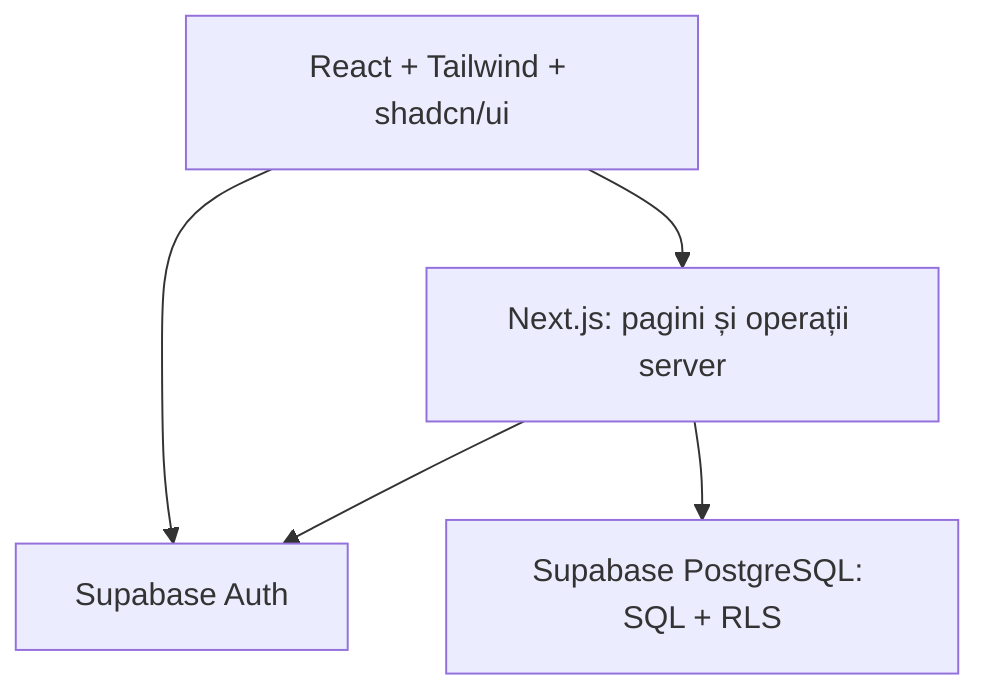

# AUTOSTART VANCEA Manager — dosar tehnic central

**Versiune:** 1.0 — proiect de specificație  
**Data:** 23.09.2026  
**Domeniu:** administrarea unei școli de șoferi, exclusiv categoria B  
**Stadiu:** analiză înaintea implementării; nu există în acest dosar migrații sau cod executabil.

## 1. Scop, limite și vocabular

Aplicația urmărește întregul parcurs administrativ al unui cursant: înregistrarea persoanei, înscrierea, repartizarea instructorului, ședințele practice, plățile și încercările de examen. Personalul școlii vede datele necesare activității sale, iar cursantul vede numai datele proprii. Proiectul academic trebuie să arate distinct interfața React, logica de server Next.js, modelarea relațională și interogările SQL, autentificarea, autorizarea, validările, algoritmul pentru suprapuneri și testarea.

Versiunea 1 este pentru o singură școală și categoria B. Nu include alte categorii, plăți online, emiterea documentelor oficiale, SMS, integrare cu autorități sau reguli legale privind eligibilitatea la examen care nu au fost specificate. Datele demonstrative vor fi fictive.

**Termeni:** „înscriere activă” = rând în `inscrieri` cu `stare = 'activa'`; „programare ocupantă” = orice programare cu `stare` diferită de `anulata`; „minute efectuate” = durată practică realizată și confirmată pentru o ședință `finalizata`; „tarif agreat” = prețul fixat pentru înscrierea concretă, în RON; „rest de plată” = diferența dintre tarif și plățile nete confirmate.

## 2. Cerințe funcționale

| ID | Cerință și rezultat observabil |
| --- | --- |
| F01 | Autentificare prin Supabase Auth și deconectare; utilizatorii fără cont activ nu văd datele școlii. |
| F02 | Rolurile `administrator`, `secretariat`, `instructor`, `cursant` determină atât paginile, cât și operațiile acceptate de server și baza de date. |
| F03 | Administrare persoane și cursanți: creare, citire, corectare, căutare și trecere în stare inactivă, cu validarea datelor. |
| F04 | Administrare instructori și vehicule, inclusiv starea de disponibilitate. |
| F05 | Înscriere cursant la B, stabilire tarif și repartizare instructor; păstrarea înscrierilor mai vechi. |
| F06 | Creare, vizualizare, filtrare și anulare programări; respingerea automată a suprapunerilor de cursant, instructor sau vehicul, inclusiv la cereri simultane. |
| F07 | Trecere ședință în `finalizata` sau `absent`; orele efectuate sunt calculate din minutele efective ale ședințelor finalizate. |
| F08 | Înregistrare plăți și rambursări cu trasabilitate; total achitat și rest calculate la citire, per înscriere. |
| F09 | Înregistrare încercări distincte de examen `teoretic` și `practic`, cu istoric și rezultat. |
| F10 | Panou principal cu indicatori relevanți rolului; rapoarte filtrabile, fără scurgere de informații între utilizatori. |
| F11 | Căutare și filtrare pentru listele autorizate; feedback clar pentru date invalide, lipsă rezultate și conflicte de programare. |
| F12 | CRUD logic: operațiile de „ștergere” pentru înregistrări importante modifică starea sau înregistrează o corecție, fără eliminarea fizică obișnuită. |

## 3. Cerințe nefuncționale

| ID | Cerință verificabilă |
| --- | --- |
| N01 | Interfață în română, utilizabilă la 360 px (telefon), 768 px (tabletă) și 1280 px (calculator), fără derulare orizontală pentru fluxurile principale. |
| N02 | Navigare cu tastatura, etichete pentru câmpuri, stare de focus vizibilă, mesaje de eroare asociate câmpurilor și contrast lizibil. |
| N03 | Validare atât în interfață, cât și pe server; constrângeri SQL pentru integritatea care trebuie să reziste inclusiv accesului concurent. |
| N04 | Datele personale se afișează doar în limita atribuțiilor; nu se publică secrete, parole, CNP sau date reale în cod, teste și capturi. |
| N05 | Istoricul înscrierilor, programărilor, plăților și examenelor rămâne inteligibil după schimbarea stărilor. |
| N06 | Un set de date demonstrative de ordinul a 1.000 de cursanți permite căutare paginată și pagini principale utilizabile; timpul de răspuns se măsoară în test, fără promisiune de SLA pentru servicii externe. |
| N07 | Migrații SQL versionate, cod tipizat, convenții românești consecvente și instrucțiuni de rulare reproductibile pe Windows. |
| N08 | Erorile din jurnale nu includ parole, tokenuri sau date personale inutile; accesul la mediu și copiile de siguranță se stabilesc înaintea datelor reale. |

## 4. Roluri și permisiuni

`utilizatori.rol` reprezintă **un singur rol principal** pentru un cont în versiunea 1. O persoană poate exista în `persoane` fără cont de autentificare; `utilizatori` este legătura opțională cu `auth.users`. Contul administratorului inițial se creează printr-o procedură administrativă protejată, nu prin înscriere publică. Conturile personalului și cursanților sunt invitate sau activate de administrator.

| Resursă / acțiune | administrator | secretariat | instructor | cursant |
| --- | --- | --- | --- | --- |
| Conturi și atribuirea rolurilor | Creează, dezactivează, schimbă rol | Fără acces | Fără acces | Fără acces |
| Persoane, cursanți și instructori | Administrare | Administrare | Citește doar datele necesare cursanților repartizați | Citește propriul profil |
| Vehicule | Administrare | Administrare | Citește vehiculele relevante programărilor sale | Citește doar vehiculul propriei programări |
| Înscrieri | Administrare | Creează, modifică stare și repartizează | Citește înscrierile repartizate | Citește propriile înscrieri |
| Programări | Administrare | Creează, replanifică prin anulare și creare, anulează | Citește propriile ședințe; marchează doar ședințele sale `finalizata`/`absent` | Citește propriile ședințe |
| Plăți/rambursări | Administrare și corecții | Înregistrează și citește, conform procedurii interne | Fără acces la sume | Citește propriul istoric și restul |
| Examene | Administrare | Înregistrează încercări și rezultate | Citește rezultatele cursanților repartizați | Citește propriul istoric |
| Panou și rapoarte | Total școală | Operațional și financiar | Numai activitatea proprie | Numai datele proprii |

Interfața ascunde acțiunile interzise, însă fiecare citire sau scriere este verificată din nou în server și, pentru tabelele expuse, în RLS. Un instructor care pierde repartizarea păstrează acces numai la ședințele sale istorice și la informația minimă necesară pentru ele; nu primește implicit acces la toate datele cursantului. Este interzisă modificarea propriului rol prin actualizarea directă a `utilizatori`.

## 5. Module și arhitectură

Module: **acces și conturi**, **persoane/cursanți**, **instructori**, **vehicule**, **înscrieri**, **programări/ședințe**, **plăți**, **examene**, **panou/rapoarte**, **administrare și documentație**. Fiecare modul are pagini, validări, operații pe server, interogări și teste aferente.



- **Frontend:** Next.js App Router + React + TypeScript, Tailwind CSS și componente shadcn/ui. Afișează formulare, liste, filtre și feedback; poate valida imediat cu Zod, dar nu decide singur drepturile.
- **Backend:** componente server, acțiuni server sau rute Next.js. Citește identitatea verificată, încarcă rolul din datele controlate de aplicație, validează cu Zod, autorizează operația și transmite cererea către baza de date. Serverul nu acceptă `rol`, `id_cursant` sau `id_utilizator_creare` de la client ca dovadă de autoritate.
- **Date:** PostgreSQL în Supabase; chei străine, indexuri, constrângeri, interogări agregate, RLS și operații tranzacționale. Pentru verificările care privesc mai multe tabele se proiectează funcții/declanșatoare SQL cu drepturi restrânse și teste de concurență; un simplu mesaj în formular nu garantează integritatea.
- **Sesiune:** integrare Supabase SSR cu cookie și client separat pentru server/browser, potrivit documentației versiunii instalate. Cheia publicabilă poate fi folosită cu RLS; o cheie secretă rămâne exclusiv pe server și se evită în fluxurile obișnuite. [S1] [S2]
- **Publicare ulterioară:** Git/GitHub pentru surse și migrații, Vercel pentru aplicație, Supabase pentru Auth și date. Publicarea este etapa 18, după teste și configurarea mediului; nu face parte din acest dosar.

### Traseul unei operații sensibile

Exemplu: secretariatul trimite o programare → Zod verifică forma și datele → serverul verifică utilizatorul și rolul → funcția/tranzacția SQL verifică înscrierea activă și vehiculul → trei constrângeri împiedică suprapunerea → RLS/granturile împiedică accesul neautorizat → interfața afișează confirmare sau motivul conflictului. Niciun pas din browser nu înlocuiește controlul de la server sau din baza de date.

## 6. Schema relațională propusă

Schema are **exact cele nouă tabele proprii aprobate**. `auth.users` este tabela furnizată de Supabase Auth, nu a zecea tabelă proprie. Identificatorii tehnici proprii sunt în română fără diacritice; nume impuse de framework, SQL și Supabase rămân standard. Cheile sunt `uuid`, iar orele se stochează ca `timestamptz` și se afișează în zona `Europe/Bucharest`. Coloanele de audit `data_crearii` și `data_modificarii` se folosesc unde sunt relevante, fără a pretinde că ele reprezintă singure un jurnal complet de modificări.

| Tabelă | Chei și date de bază propuse | Legături / constrângeri esențiale |
| --- | --- | --- |
| `persoane` | `id_persoana` PK; `nume`, `prenume` NOT NULL; `telefon`, `email`, `data_nasterii`, `adresa` opționale după necesitate | Sursă unică a datelor de contact. Nu se consideră numele unic. CNP din schița anterioară **nu intră implicit** în versiunea 1; vezi §8. Adresa de autentificare din Auth este distinctă de adresa de contact până la o actualizare controlată a ambelor. |
| `utilizatori` | `id_utilizator` PK = ID-ul din `auth.users`; `id_persoana` NOT NULL UNIQUE; `rol` NOT NULL; `activ` NOT NULL | FK către `auth.users(id)` și `persoane(id_persoana)`; `rol` permis doar în cele patru valori. Nicio parolă locală. Numai flux privilegiat poate modifica rol/activare. |
| `cursanti` | `id_cursant` PK; `id_persoana` NOT NULL UNIQUE; `stare`, `observatii` | FK la `persoane`; fără ștergere fizică obișnuită. Nu se cere cont de login pentru fiecare cursant. |
| `instructori` | `id_instructor` PK; `id_persoana` NOT NULL UNIQUE; `stare`, `data_angajarii`, `observatii` | FK la `persoane`; numai instructor `activ` poate primi programări noi. |
| `vehicule` | `id_vehicul` PK; `numar_inmatriculare` NOT NULL UNIQUE după normalizare; `marca`, `model`, `stare`, alte caracteristici necesare | Stări: `activ`, `service`, `indisponibil`, `inactiv`; numai `activ` permite programări noi. |
| `inscrieri` | `id_inscriere` PK; `id_cursant`, `id_instructor` NOT NULL; `data_inscrierii`, `tarif_curs` `numeric(12,2)` NOT NULL, `stare` | FK la cursant și instructor; `tarif_curs > 0`; `categorie = 'B'` dacă se păstrează explicit categoria. Index unic parțial pe `id_cursant` când `stare = 'activa'`; UNIQUE(`id_inscriere`, `id_cursant`) pentru FK compus. |
| `programari` | `id_programare` PK; `id_inscriere`, `id_cursant`, `id_instructor`, `id_vehicul` NOT NULL; `inceput`, `sfarsit` NOT NULL; `stare` NOT NULL, `minute_efectuate`, `id_utilizator_creare` NOT NULL | FK compus (`id_inscriere`, `id_cursant`) la `inscrieri`; FK la instructor, vehicul și utilizator creator. `sfarsit > inceput`. `id_cursant` este o identitate duplicată **controlată** prin FK compus, necesară constrângerii directe de suprapunere; nu este un total derivat. |
| `plati` | `id_plata` PK; `id_inscriere` NOT NULL; `tip` = `plata`/`rambursare`; `suma` `numeric(12,2)` NOT NULL; `stare` NOT NULL, `data_platii` NOT NULL, `id_utilizator_inregistrare` NOT NULL, `id_plata_initiala` opțional | FK la înscriere și utilizator; rambursarea referă plata inițială prin FK la `plati`. `suma > 0`. Plățile confirmate nu se rescriu pentru corecții: se introduce eveniment nou. Nu există coloană stocată `total_achitat`. |
| `examene` | `id_examen` PK; `id_inscriere` NOT NULL; `tip_examen` = `teoretic`/`practic`; `numar_incercare`, `data_examenului`, `stare` NOT NULL; `rezultat`, `punctaj` opționale | FK la înscriere; UNIQUE(`id_inscriere`, `tip_examen`, `numar_incercare`); un rând pentru fiecare încercare; rezultatul poate fi necompletat până la susținere. |

Relații principale: `persoane` 1–0..1 `utilizatori` / `cursanti` / `instructori`; `cursanti` 1–N `inscrieri`; `instructori` 1–N `inscrieri`; `inscrieri` 1–N `programari`, `plati`, `examene`; `instructori` și `vehicule` 1–N `programari`. `programari.id_instructor` păstrează instructorul efectiv al ședinței, inclusiv după schimbarea instructorului curent din `inscrieri`.

Stările propuse sunt: `inscrieri`: `activa`, `finalizata`, `anulata`; `programari`: `programata`, `finalizata`, `anulata`, `absent`; `plati`: `in_asteptare`, `confirmata`, `anulata`; `examene.stare`: `programat`, `sustinut`, `anulat`, `neprezentat`, iar `rezultat` este `admis` sau `respins` numai pentru examenul susținut. Pentru celelalte tabele, `activ`/`inactiv` și stările vehiculului sunt definite mai sus. Tranzițiile permise se validează la server și în operațiile SQL relevante; un cont `utilizatori.activ = false` nu autorizează citirea datelor nici dacă sesiunea Auth încă există.

Indexuri suplimentare: FK-urile din listele mari (`id_cursant`, `id_instructor`, `id_inscriere`, `id_vehicul`), `programari(inceput)`, `examene(id_inscriere, data_examenului)`, `plati(id_inscriere, data_platii)`; se revizuiesc după interogările reale. `NOT NULL`, `UNIQUE`, `CHECK` și FK se definesc în migrațiile SQL, iar indexurile care impun reguli sunt documentate separat de cele pentru performanță. FK pentru istoric folosesc restricționarea ștergerii, nu ștergere în cascadă a înscrierilor sau plăților.

### Constrângeri decisive

1. **O înscriere activă:** index unic parțial pentru `inscrieri(id_cursant) WHERE stare = 'activa'`. Un simplu `UNIQUE(id_cursant, stare)` ar interzice și mai multe înscrieri finalizate; de aceea nu este adecvat. [P1]
2. **Trei resurse fără suprapuneri:** constrângeri de excludere GiST separate pentru `id_cursant`, `id_instructor` și `id_vehicul`, fiecare împreună cu intervalul `tstzrange(inceput, sfarsit, '[)')`, numai pentru programările neanulate. Extensia `btree_gist` permite combinarea egalității UUID cu intervalul. Capătul drept deschis face ca 10:00–12:00 și 12:00–14:00 să nu se suprapună. [P2]
3. **Vehicul și repartizare disponibile:** `CHECK` nu poate compara starea dintr-o altă tabelă. O operație SQL tranzacțională verifică și blochează vehiculul înainte de rezervare, verifică înscrierea activă și cere instructorul repartizat curent. Schimbarea vehiculului în `service`/`indisponibil` sau schimbarea repartizării cere rezolvarea explicită a programărilor viitoare afectate. Constrângerile de excludere protejează și cazul a două rezervări trimise simultan. [P1]
4. **Sume și durate:** `minute_efectuate` este un fapt pentru fiecare ședință efectivă, nu totalul cursantului; este pozitiv numai pentru `finalizata` și cel mult durata planificată. Totalul practic se obține prin `SUM(minute_efectuate)/60`, excluzând `anulata` și `absent`. Sumele plătite sunt `SUM(plata confirmata) - SUM(rambursare confirmata)`; restul este calculat din `tarif_curs` minus această sumă netă. În V1 se resping tranzacțional plățile confirmate care depășesc restul și rambursările care depășesc suma plătită net sau suma plății inițiale; operațiile pe aceeași înscriere se serializează prin blocarea rândului de înscriere.
5. **Istoricul încercărilor:** nu se suprascrie un examen respins cu unul admis; se creează `numar_incercare` următor în aceeași înscriere și pentru același tip de examen.

## 7. Reguli de business și exemple

| ID | Regulă | Comportament la limită / mesaj util |
| --- | --- | --- |
| B01 | Cel mult o înscriere `activa` pentru un cursant. | O înscriere veche `finalizata` permite una nouă activă; două cereri simultane nu creează două active. |
| B02 | O programare nouă cere înscriere activă, instructor activ și vehicul activ. | Dacă resursa își schimbă starea între formular și salvare, salvarea se respinge și se explică motivul. |
| B03 | Cursantul, instructorul și vehiculul nu au rezervări ocupante suprapuse. | Intervalele 10:00–12:00 și 12:00–14:00 sunt compatibile; 11:00–13:00 este refuzat. |
| B04 | O programare `anulata` eliberează intervalul; `finalizata` și `absent` rămân în istoric și în verificarea suprapunerilor. | Reprogramarea înseamnă anularea celei vechi și crearea unui rând nou. |
| B05 | Închiderea unei înscrieri nu lasă programări viitoare active nerezolvate. | Secretariatul le anulează/repartizează explicit înainte de finalizare. |
| B06 | Numai ședințele `finalizata` cu minute confirmate contribuie la ore. | 120 + 90 minute finalizate și o absență = 3,5 ore; nu se stochează `ore_total`. |
| B07 | O plată confirmată este păstrată; corecția produce eveniment nou identificabil. | Tarif 1.000 RON, plăți 300 + 250 RON: achitat 550, rest 450. Rambursare 50: achitat net 500, rest 500. |
| B08 | Încercările de examen sunt înregistrări distincte. | Un rezultat `respins` urmat de `admis` păstrează ambele rânduri. |
| B09 | Categoria este numai B; identificatorii proprii folosesc română fără diacritice. | Numele obligatorii `page.tsx`, `layout.tsx`, `route.ts`, `auth.users` și API-urile bibliotecilor își păstrează forma standard. |
| B10 | Orice citire sau modificare cere acces potrivit rolului și relației cu cursantul. | Schimbarea unui ID în URL sau trimiterea directă a unei cereri API nu extinde accesul. |
| B11 | Programarea nouă folosește instructorul repartizat curent; la schimbarea repartizării se rezolvă mai întâi programările viitoare afectate. | Ședințele trecute păstrează instructorul care le-a susținut. |

## 8. Probleme de proiectare constatate și decizii înainte de cod

Am comparat cerința actuală cu schița anterioară **„Schema relațională AUTOSTART VANCEA.png”**. Schița confirmă cele nouă tabele și multe dintre FK-uri, dar reprezintă o bază conceptuală, nu o migrație SQL gata de rulare.

| Problema | De ce contează | Propunere pentru versiunea 1 / punct de confirmat |
| --- | --- | --- |
| Permisiunile apar abia la etapa 13, deși modulele 5–12 gestionează date personale. | Un modul CRUD expus înaintea autorizării poate permite acces necuvenit. | În etapele 3–4 se pun rolurile, granturile și RLS minim necesare; etapa 13 este auditul complet și testarea de regresie a tuturor permisiunilor. |
| Schița veche nu are `id_cursant` în `programari`. | Nu se poate face direct o constrângere de excludere pe cursant printr-un FK către `inscrieri`. | Adăugăm `id_cursant` verificat prin FK compus și trei constrângeri de excludere; alternativa este o funcție tranzacțională cu blocare pe cursant, mai greu de verificat. |
| Starea vehiculului și înscrierea activă sunt în alte tabele. | Un `CHECK` pe `programari` nu poate garanta singur aceste reguli. | Verificare tranzacțională în SQL și test de concurență; nicio aprobare bazată doar pe verificarea din frontend. |
| Tariful, „orele” și rezultatele financiare pot însemna lucruri diferite. | Numărarea intervalelor planificate ca ore efectuate sau stocarea unor totaluri ar produce rapoarte greșite. | `tarif_curs` la fiecare înscriere, `minute_efectuate` la ședința finalizată, totaluri din interogări; implicit o „oră” = 60 de minute până la confirmarea unei alte unități. |
| Schița veche conține `cnp UNIQUE`. | Este un identificator personal cu impact ridicat; cerința actuală nu spune că este necesar. | Nu îl colectăm implicit în prototip. Dacă este obligatoriu operațional, definim scopul, accesul restrâns, date de test fictive și regula de retenție înaintea migrării. |
| Schimbarea instructorului într-o înscriere poate pierde istoricul repartizării. | `programari.id_instructor` arată cine a ținut fiecare ședință, dar nu când s-a schimbat repartizarea implicită între ședințe. | Versiunea 1 păstrează instructorul efectiv pe fiecare ședință; dacă se cere jurnal complet al tuturor repartizărilor, va fi nevoie de a zecea tabelă aprobată separat sau de un mecanism de audit definit explicit. |
| Un singur `rol` nu reprezintă o persoană cu două funcții. | De exemplu, un administrator care este și instructor. | Un singur rol principal per cont în V1; combinațiile de roluri cer revizuirea modelului de autorizare. |
| Plățile corectate și rambursările nu sunt definite în cerința inițială. | Suprascrierea sumei ar șterge istoricul financiar. | În V1 există `tip = plata/rambursare`, stare de confirmare și rânduri noi pentru corecții; fără integrare bancară. |
| Nu sunt date reguli despre durata didactică, disponibilitatea recurentă sau condițiile pentru examene. | Nu este justificat să inventăm praguri sau cerințe normative. | Nu codificăm aceste condiții în V1 până la stabilirea lor; programarea folosește intervale reale și verifică resursele. |
| Folderul local Windows și conținutul lui actual nu sunt vizibile în această sesiune. | Inițializarea peste fișiere existente sau ignorarea tardivă a lui `programe` poate fi greșită. | Prima sarcină Codex locală începe cu inventarul, apoi `.gitignore`; dacă `programe` este deja urmărit de Git, se raportează și se explică remedierea înainte de orice schimbare. |

**Puncte de confirmat înainte de etapele relevante:** necesitatea CNP înainte de etapa 3; definiția orei practice înainte de etapa 10; necesitatea istoricului complet al repartizărilor înainte de etapa 8; posibilitatea unor roluri multiple înainte de etapa 4. Valorile implicite din tabel oferă o specificație coerentă pentru prototip, fără a prezenta aceste opțiuni ca decizii luate deja de beneficiar.

## 9. Securitate și protecția datelor

1. Supabase Auth administrează autentificarea și parolele. `utilizatori.id_utilizator` referă `auth.users.id`; nu apar coloane pentru parole, hash-uri sau tokenuri în tabelele proprii.
2. Serverul verifică identitatea prin metoda recomandată de documentația Supabase pentru versiunea instalată; cookie-ul sau un `id_utilizator` trimis de browser nu reprezintă singur dovada identității. [S1]
3. Politicile RLS și granturile se activează/testează pe fiecare tabelă expusă. Citirea și scrierea pe `persoane` sunt deosebit de restrictive, fiind sursa comună pentru cursanți și instructori. Rolul aplicației vine din `utilizatori`, o tabelă modificabilă numai prin flux privilegiat, nu din metadate controlate de utilizator. [S2]
4. Frontendul, serverul și baza de date verifică aceeași intenție prin mecanisme potrivite fiecărui strat. Pentru mutațiile critice, funcțiile SQL protejate verifică identitatea și rolul, nu presupun că orice apelant de funcție este administrator. Funcțiile cu drepturi elevate sunt restrânse explicit; nu se bazează generic pe o cheie care ocolește RLS.
5. Cheile se pun în variabile de mediu: cheia publicabilă poate ajunge în browser, cheia secretă nu. `.env.local`, ieșirile de compilare, `node_modules` și `programe` nu se includ în Git. Un `.env.example` conține numai numele variabilelor, fără valori reale. [S3]
6. Conturile demo, plățile și datele de test sunt fictive. Exporturile/rapoartele respectă aceleași drepturi precum ecranele. Nu se loghează date personale sau secrete fără necesitate.
7. Pentru date reale se stabilesc separat procedura de acces, retenția, ștergerea/anonimizarea permisă și copiile de siguranță; nu se presupune că simpla stare `inactiv` rezolvă aceste obligații.

## 10. Structura proiectului propusă

Structura de mai jos descrie destinația în folderul local Windows indicat de beneficiar. **Nu afirmă că aceste subfoldere sau fișiere există deja acolo.**

```text
D:\Proiecte\AUTOSTART-VANCEA\
├── .gitignore                  # primul fișier de protecție pentru Git
├── README.md                   # pornire și orientare
├── baza_date\
│   ├── migrari\               # schema, constrângeri, RLS, funcții SQL
│   └── date_demonstrative\     # numai date fictive
├── cod\
│   ├── src\app\               # page.tsx, layout.tsx, route.ts: convenții Next.js
│   ├── src\componente\        # componente proprii în română
│   ├── src\lib\               # acces, validări, interogări
│   └── public\                # resurse publice neconfidențiale
├── documentatie\
│   └── DOSAR_TEHNIC_AUTOSTART_VANCEA_Manager.md
├── programe\                   # existent; exclus integral din Git
└── teste\                      # scenarii, rezultate, eventual teste automate
```

Git se inițializează la rădăcina `AUTOSTART-VANCEA` **numai după inspectarea conținutului**. `.gitignore` de la rădăcină trebuie să excludă cel puțin `/programe/`, `node_modules`, `.next`, `.env*` cu excepția exemplului neconfidențial și alte artefacte generate. Comanda `git status` și lista fișierelor urmărite verifică excluderea înaintea oricărei publicări. Dacă `cod` nu este gol, generatorul Next.js nu se rulează peste el fără inventar.

## 11. Plan etapizat și criteriul de trecere

O etapă este gata când rezultatul ei rulează, testul asociat trece și schimbările sunt descrise în jurnalul proiectului. Documentația se completează pe parcurs, iar la etapa 19 se asamblează și verifică forma academică.

| Etapa | Livrabil mic și verificare înainte de continuare |
| --- | --- |
| 1. Inițializare și Git | **1A:** inventar local, `.gitignore`, Git și confirmarea că `programe`/secretele nu apar în fișierele urmărite. **1B:** aplicație Next.js în `cod` numai după inventar; pagină de pornire, `npm run dev`, verificări de lint/build. |
| 2. Conexiune Supabase | Proiect/configurație de dezvoltare, variabile de mediu fără secrete în Git; test controlat al conexiunii și eroare clară dacă lipsesc cheile. |
| 3. Schema PostgreSQL | Cele nouă tabele, cheile, `CHECK`, indexuri și migrații reproductibile; RLS/granturi restrictive inițiale; teste de chei și înscriere activă. |
| 4. Autentificare | Login/logout, sesiune SSR, conturi demonstrative cu patru roluri și verificare server; politici RLS minimale testate înainte de orice CRUD personal. |
| 5. Cursanți | Listă, căutare, creare, corectare și inactivare cu validări; test de acces pentru secretariat/instructor/cursant. |
| 6. Instructori | CRUD logic, stare activ/inactiv, cont opțional; un instructor nu vede datele altuia. |
| 7. Vehicule | Evidență și stări; vehicul inactiv nu poate fi folosit la rezervare. |
| 8. Înscrieri | Înscriere B, tarif fixat, repartizare; test pentru două înscrieri active concurente și înscrieri istorice. |
| 9. Programări | Intervale `[)`, trei verificări de suprapunere, conflict afișat inteligibil; teste la capete și în paralel. |
| 10. Ședințe și ore | Tranziții de stare, minute efective și total calculat; teste pentru finalizată/anulată/absent. |
| 11. Plăți | Înregistrări și corecții, total și rest din interogări; teste sumă, rambursare și permisiuni. |
| 12. Examene | Teorie/practică și încercări succesive fără pierderea istoricului; filtre și teste de unicitate. |
| 13. Permisiuni | Audit exhaustiv al matricei pe interfață, rute/acțiuni server, granturi și RLS; remedierea oricărei rute omise. Protecția de bază există deja din etapele 3–4. |
| 14. Panou principal | Indicatori pe rol, construiți din interogări cu acces autorizat; teste pentru valori și izolare. |
| 15. Rapoarte | Filtre, agregări SQL și export numai dacă este necesar; rezultate verificate pe un set fictiv cunoscut. |
| 16. Design responsive | Revizie completă pentru telefon/tabletă/calculator, tastatură și erori; fluxurile principale sunt utilizabile la cele trei lățimi. |
| 17. Testare | Suită integrată, scenarii adverse, concurență, lint/build, testare manuală și evidența rezultatelor. |
| 18. Publicare | Numai după verificări: GitHub, variabile Vercel/Supabase, migrații controlate și verificare în mediul publicat cu date fictive. |
| 19. Documentație academică | Cerințe, arhitectură, diagramă relațională, justificarea SQL/algoritmilor, capturi, teste, rezultate, limitări și ghid de utilizare actualizate la implementarea reală. |

## 12. Plan de testare

Testele unitare verifică validările și calculele pure; testele SQL verifică integritatea, concurența și RLS; testele de integrare verifică fluxurile server–bază de date; verificarea manuală urmărește interfața și utilizarea pe dispozitive. Când mediul de dezvoltare permite, politicile RLS se pot testa cu instrumentele SQL/pgTAP documentate de Supabase. [S4]

| ID | Scenariu | Rezultat așteptat |
| --- | --- | --- |
| T01 | Două înscrieri active pentru același cursant, inclusiv cereri simultane. | Cel mult una este salvată; înscrierile finalizate anterioare rămân. |
| T02 | Cursant: 10:00–12:00 urmat de 12:00–14:00; apoi încercare 11:00–13:00. | Primele două sunt acceptate, a treia respinsă. |
| T03 | Instructor comun pentru două cursanți la ore suprapuse. | A doua programare este respinsă. |
| T04 | Vehicul comun pentru doi instructori la ore suprapuse. | A doua programare este respinsă. |
| T05 | Două rezervări identice trimise simultan. | Numai una reușește; nu rămâne stare inconsistentă. |
| T06 | Vehicul `service`/`indisponibil` la rezervare; apoi încercare de a indisponibiliza un vehicul cu rezervări viitoare. | Rezervarea este respinsă; schimbarea stării cere rezolvarea rezervărilor viitoare. |
| T07 | Anularea unei programări și refolosirea intervalului. | Noua rezervare este permisă; programarea anulată rămâne vizibilă în istoric. |
| T08 | 120 + 90 minute finalizate, o absență și o anulare. | Totalul este 210 minute = 3,5 ore; niciun total duplicat în tabele. |
| T09 | Tarif 1.000 RON, plăți 300 + 250, rambursare 50. | Net achitat 500, rest 500; rândurile inițiale nu sunt rescrise. |
| T10 | Tentativă de plată peste rest și două plăți simultane pentru același rest. | Plata care depășește restul este respinsă; dintre două plăți concurente incompatibile, cel mult una este confirmată. |
| T11 | Două încercări teoretice: respins, admis; duplicarea numărului de încercare. | Istoricul rămâne; duplicatul este respins. |
| T12 | Cursantul schimbă ID-ul în URL ori apelează direct ruta altui cursant. | Serverul/RLS refuză accesul; interfața nu dezvăluie date. |
| T13 | Instructorul încearcă să marcheze ședința altui instructor sau să vadă plăți. | Operațiile sunt respinse indiferent de butoanele afișate. |
| T14 | Încercare de a schimba rolul propriu sau de a accesa tabele ca utilizator anonim. | Rolul rămâne nemodificat; datele nu sunt accesibile. |
| T15 | Lipsa câmpurilor, interval invers, sumă negativă, stare nevalidă. | Mesaj clar în română; serverul și SQL resping valorile. |
| T16 | Telefon/tabletă/desktop, tastatură, rezultate goale, conexiune eșuată. | Fluxurile de bază rămân utilizabile, fără date ascunse sau derulare orizontală. |
| T17 | `git status`, fișiere urmărite și conținutul buildului. | `programe`, `.env.local`, `node_modules`, `.next` și cheile secrete lipsesc din Git și din codul client. |

Rezultatele se consemnează cu dată, versiune/commit, date fictive folosite, rezultat obținut și remediere. Testele de securitate sunt refăcute la fiecare nouă tabelă sau rută, nu doar la etapa 17.

## 13. Criterii de finalizare a proiectului

Proiectul este complet când:

1. Cele patru roluri pot parcurge fluxurile permise, iar operațiile interzise sunt respinse în interfață, pe server și în RLS unde se aplică.
2. Cele nouă tabele, migrațiile, cheile, constrângerile și interogările SQL sunt reproductibile și explicate; parolele rămân exclusiv în Supabase Auth.
3. Cursanții, instructorii, vehiculele, înscrierile, programările, plățile și examenele sunt funcționale cu date fictive și cu istoric păstrat.
4. Regula unei singure înscrieri active și cele trei reguli de nesuprapunere rezistă la cereri concurente; intervalele cu capăt comun sunt acceptate.
5. Orele, totalul achitat și restul sunt calculate din fapte, cu rezultatele scenariilor T08–T09 corecte.
6. Panoul, rapoartele, căutarea și filtrarea respectă rolurile; fluxurile esențiale funcționează la dimensiunile de ecran stabilite.
7. Testele relevante trec, erorile cunoscute și limitele sunt consemnate, buildul rulează, iar Git nu conține programe instalate, secrete sau date personale reale.
8. Instanța publicată, dacă este aprobată la etapa 18, reproduce versiunea testată și are instrucțiuni de configurare; documentația academică arată arhitectura, schema, SQL, algoritmii, testele și rezultatele reale.

## 14. Prima sarcină concretă pentru Codex local

**Etapa 1A: inventar și protecția Git**, fără inițializarea aplicației. În VS Code se deschide `D:\Proiecte\AUTOSTART-VANCEA`, apoi i se cere lui Codex să inspecteze numai structura și starea Git, să explice înainte comenzile, să creeze `.gitignore` la rădăcină cu excluderea completă a `/programe/` și a secretelor/buildurilor, să inițializeze Git numai dacă nu există deja un depozit și să dovedească prin `git status` și lista fișierelor urmărite că `programe` este exclus. Dacă observă fișiere urmărite anterior în `programe`, trebuie să explice constatarea și remedierea înainte de a modifica indexul Git. Se oprește și arată ce a făcut; `cod` și programele instalate nu sunt mutate, șterse sau reinstalate.

**Poarta de trecere la 1B:** conținutul existent este cunoscut, `.gitignore` este corect, `programe` nu figurează printre fișierele urmărite și nu s-au pierdut fișiere. Abia atunci se alege modul sigur de inițializare Next.js în `cod`.

## 15. Surse tehnice pentru verificare la implementare

Consultate la 23.09.2026; înaintea fiecărei etape se verifică documentația versiunii instalate.

- [N1] Next.js, [Installation / App Router](https://nextjs.org/docs/app/getting-started/installation): inițializare, versiunea minimă Node, structură și comenzi.
- [S1] Supabase, [Creating a Supabase client for SSR](https://supabase.com/docs/guides/auth/server-side/creating-a-client): client server/browser, cookie și verificarea identității.
- [S2] Supabase, [Row Level Security](https://supabase.com/docs/guides/database/postgres/row-level-security): granturi, politici, `auth.uid()` și limitele cheilor elevate.
- [S3] Supabase, [API keys](https://supabase.com/docs/guides/getting-started/api-keys): cheie publicabilă și cheie secretă.
- [S4] Supabase, [Testing Your Database](https://supabase.com/docs/guides/database/testing): testare SQL și RLS.
- [P1] PostgreSQL, [Constraints](https://www.postgresql.org/docs/current/ddl-constraints.html): index unic parțial și limitele `CHECK` față de alte rânduri/tabele.
- [P2] PostgreSQL, [Range Types](https://www.postgresql.org/docs/current/rangetypes.html): intervale, capete `[)` și constrângeri de excludere.
